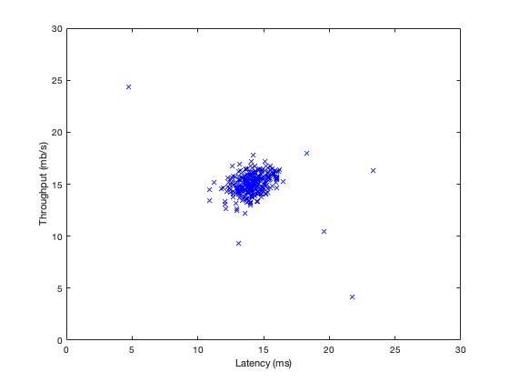
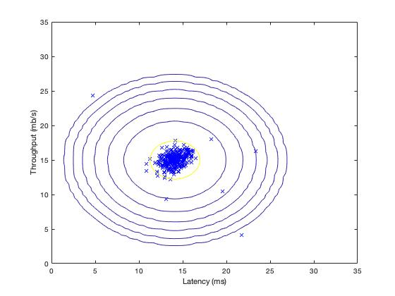

# Anomaly Detection and Recommender Systems (MATLAB)


## Purposes
#### 1) Detect failing servers on a network
#### 2) Build a recommender system for movies


## Features
#### 1) Anomaly Detection
#### 2) Recommender System
#### 3) Collaborative Filtering


## Datasets
- ex8data1.mat
- ex8data2.mat
- ex8_movies.mat


## Usage
#### 1) Open MATLAB
#### 2) Open the ex8 folder in MATLAB
#### 3) In the terminal window, execute:  
```
ex8
```
or
```
ex8_cofi
```


## Development Flow (Anomaly Detection)
#### 1) Visualize dataset


#### 2) Estimate params for Gaussian
```
mu = sum(X) / m;               % mean
sigma2 = sum( (X-mu).^2 ) / m; % standard deviation
```

#### 3) Gaussian Distribution (Contour)


#### 4) Select threshold eps, using F1 score
For each epsilon
```
predictions = (pval < epsilon);
tp = sum((predictions == 1) & (yval == 1));
fp = sum((predictions == 1) & (yval == 0));
fn = sum((predictions == 0) & (yval == 1));

prec = tp / (tp + fp);
rec = tp / (tp + fn);
    
F1 = 2 * prec * rec / (prec + rec);

if F1 > bestF1
    bestF1 = F1;
    bestEpsilon = epsilon;
end
```

#### 5) Show classified anomalies


## Development Flow (Collaborative Filtering)
#### 1) Implement cost function
```
J = sum(sum( (X*Theta' - Y).^2 .*R )) / 2;
```
where R is the selection matrix.  

#### 2) Compute gradient
```
X_grad = ((X*Theta' - Y).*R) * Theta;
Theta_grad = ((X*Theta' - Y).*R)' * X;
```

#### 3) Add regularization term to cost function
```
regularization = lambda/2*( sum(sum( Theta.^2 )) + sum(sum( X.^2 )) );
J = sum(sum( (X*Theta' - Y).^2 .*R )) / 2 + regularization;
```

#### 4) Add regularization term to gradient
```
reg_X = lambda * X;
X_grad = ((X*Theta' - Y).*R) * Theta + reg_X;

reg_theta = lambda * Theta;
Theta_grad = ((X*Theta' - Y).*R)' * X + reg_theta;
```

#### 5) Now, learn movie recommendations!


## Assignment Link
- [Anomaly Detection and Recommender Systems](https://www.coursera.org/learn/machine-learning/programming/fyhXS/anomaly-detection-and-recommender-systems)  
(Notice: you need to log in to see the programming assignment.)
