# K-Means Clustering and PCA (MATLAB)


## Purposes
#### 1) Compress images with K-means clustering
#### 2) Find a low dimensional representation of face images with PCA


## Features
#### 1) K-Means Clustering
#### 2) Image Compression
#### 3) PCA


## Datasets
- ex7data1.mat
- ex7data2.mat
- ex7faces.mat


## Usage
#### 1) Open MATLAB
#### 2) Open the ex6 folder in MATLAB
#### 3) In the terminal window, execute:  
```
ex7
```
or
```
ex7_pca
```


## Development Flow (K-Means Clustering)
#### 1) Assign a centroid index to each examples
```
idx = zeros(size(X,1), 1);

for i = 1:m
    dist = zeros(K,1);
    for j = 1:K
        diff = centroids(j,:)-X(i,:);
        dist(j) = diff * diff'; % squared euclidean distance
    end
    [M,idx(i)] = min(dist);
end
```

#### 2) Update the locations of the centroids
```
centroids = zeros(K, n);

for k = 1:K % index of centroid
    num = 0;
    sum = zeros(1,n);
    for i = 1:m % index of example
        if k == idx(i)
            num = num + 1;
            sum = sum + X(i,:);
        end
    end
    centroids(k,:) = sum / num;
end
```

#### 3) Use (1) and (2) iteratively to get converged centroid locations.
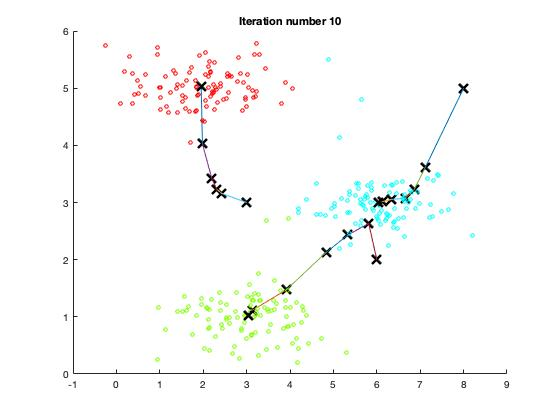

#### 4) Compress image (only using 16 colors)
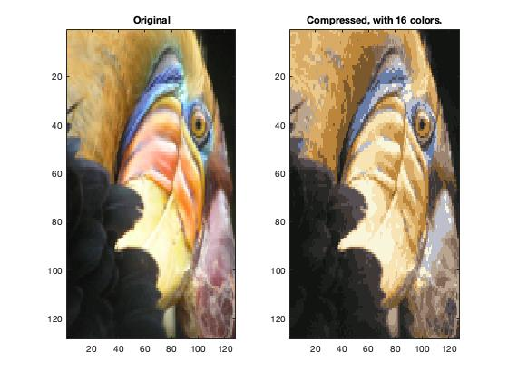
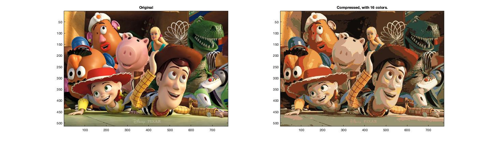


## Development Flow (PCA)
#### 1) Data Visualization
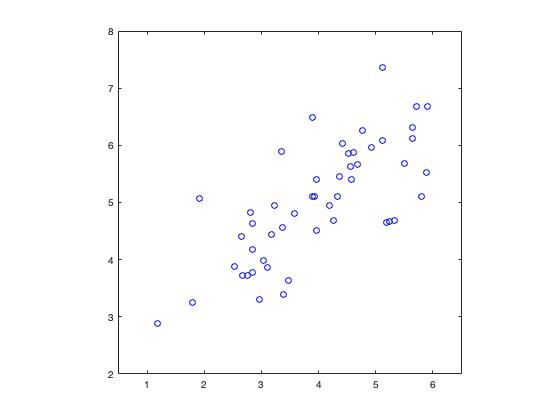

#### 2) Compute covariance matrix
```
sigma = X' * X / m;
```

#### 3) Get eigenvectors
U contains the principal components, and S contains the diagonal matrix used to calculate the variance.
```
[U, S, V] = svd(sigma);
```

#### 4) Visualize the principal components
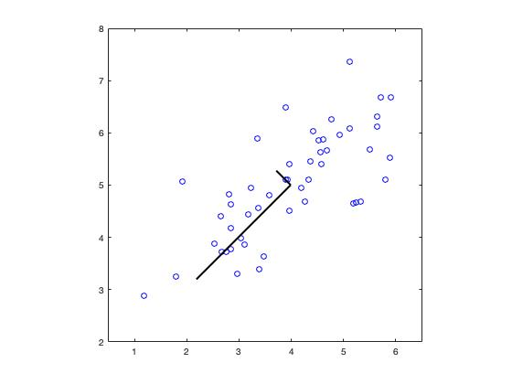

#### 5) Project data samples onto the principal components
```
U_reduce = U(:, 1:K);
Z = X * U_reduce;
```
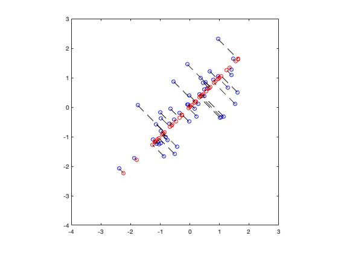

#### 6) Reconstruct an approximation of the original data
```
U_reduce = U(:, 1:K);
X_rec = Z * U_reduce';
```

#### 7) Work with face images
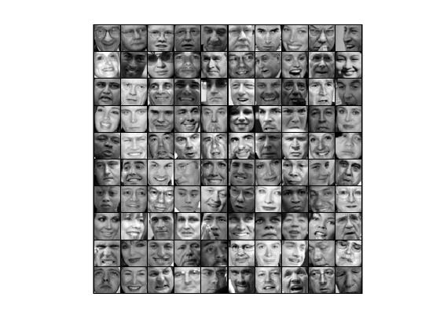

#### 8) Display first 36 principal components
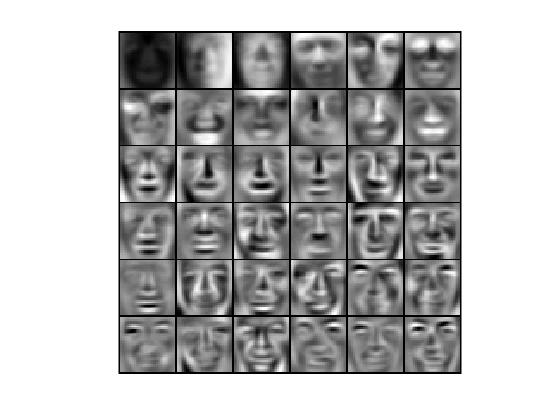

#### 9) Recover the face images after compression
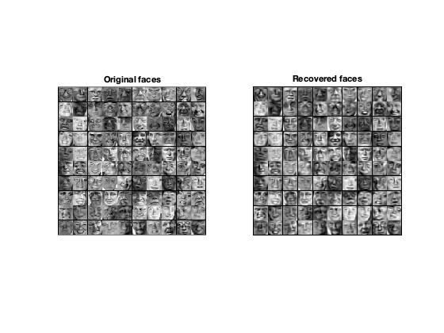

#### 10) PCA for Data Visualization
Each color indicates the same color assignment in the image compression from part 1.  
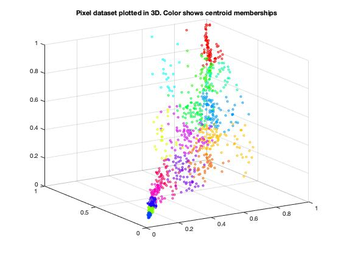
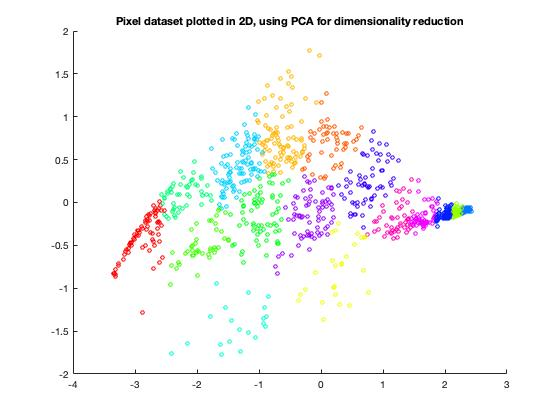


## Assignment Link
- [K-Means Clustering and PCA](https://www.coursera.org/learn/machine-learning/programming/ZZkM2/k-means-clustering-and-pca)  
(Notice: you need to log in to see the programming assignment.)
