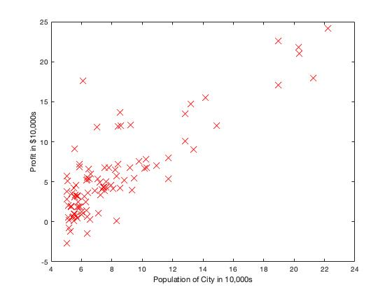
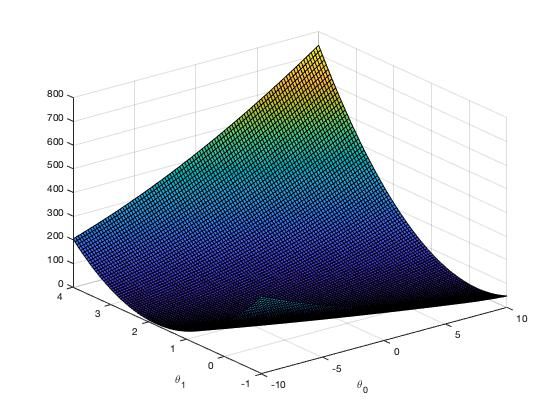
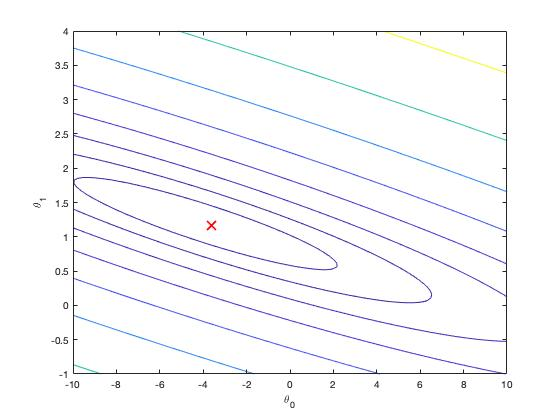
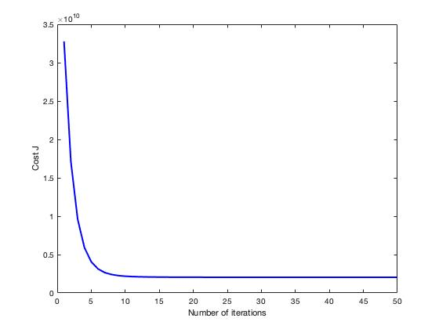
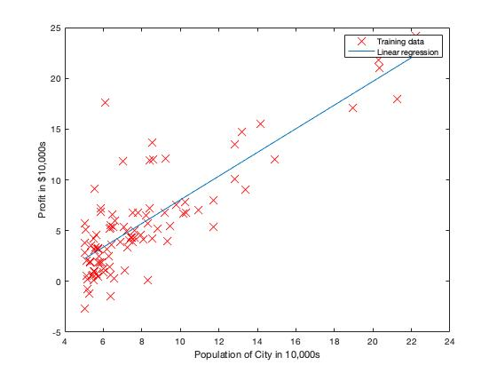

# Linear Regression (MATLAB)


## Purpose
#### 1) Predicts profits for a food truck in different cities
#### 2) Predicts housing price based on the size and the number of room in Portland, OR


## Features
#### 1) One Variable
#### 2) Multiple Variables


## Dataset
#### 1) ex1data1.txt (one variable)
#### 2) ex1data2.txt (two variables)


## Usage
#### 1) Open MATLAB
#### 2) Open the folder of this directory
#### 3) In the terminal window, execute the function name you like to run. For example:
```
warmUpExercise
```
```
ex1
```
```
ex1_multi
```


## Development Flow (One Variable)
#### 1) Data Visualization

#### 2) Gradient Descent
- Compute cost function J
- Update theta to minimize J





## Development Flow (Multiple Variable)
#### 1) Normalize features
- For the faster convergence
#### 2) Gradient Descent (Iterative method)
- Compute cost function J
- Update theta to minimize J
#### 3) Tweak learning rate alpha
Good choices:
- alpha = 0.1
- alpha = 0.3 (seen in the plot below)


#### 4) Now, predict the price of a 1650 sq-ft, 3 br house
- Do not forget to normalize the feature!
```
price = [1, (1650-mu)/sigma, 3] * theta;
```
#### 5) Also implement normal equation (Analytical method)
```
theta = pinv(X' * X) * X' * y;
```


## Result



## Assignment Link
- [Linear Regression](https://www.coursera.org/learn/machine-learning/programming/8f3qT/linear-regression) 
(Notice: you need to log in to see the programming assignment.)
