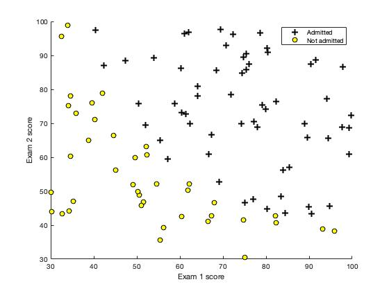
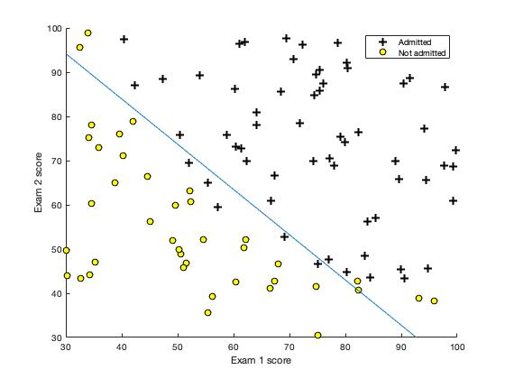

# Logistic Regression (MATLAB)


## Purpose
#### 1) Predicts university admission
#### 2) Predicts QA test result of microchips from a fabrication plant


## Dependency
- Optimization Toolbox


## Features
#### 1) Logistic Regression
#### 2) Regularized Logistic Regression


## Dataset
#### 1) ex2data1.txt (logistic regression)
#### 2) ex2data2.txt (regularized logistic regression)


## Usage
#### 1) Open MATLAB
#### 2) Open the ex2 folder in MATLAB
#### 3) In the terminal window, execute the function name you like to run.  
Logistic regression:
```
ex2
```
Regularized logistic regression:
```
ex2_reg
```


## Development Flow (Logistic Regression)
#### 1) Data Visualization

#### 2) Implement the Sigmoid function
```
g = 1 ./ (1 + exp(-z));
```
#### 3) Compute the cost function and gradient
```
h = sigmoid(X * theta);
J = 1 / m * sum(- y .* log(h) - (1-y) .* log(1-h));
grad = 1 / m * X' * (h - y);
```
#### 4) Find optimal learning parameters using fminunc
```
options = optimset('GradObj', 'on', 'MaxIter', 400);
[theta, cost] = fminunc(@(t)(costFunction(t, X, y)), initial_theta, options);
```
#### 5) Make predictions
- Don't forget to use the sigmoid function!
```
p = round(sigmoid(X * theta));
```


## Development Flow (Regularized Logistic Regressione)
Coming soon...


## Result



## Assignment Link
- [Logistic Regression](https://www.coursera.org/learn/machine-learning/programming/ixFof/logistic-regression) 
(Notice: you need to log in to see the programming assignment.)
