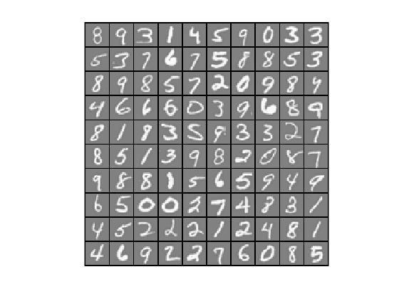

# Multi-class Classification and Neural Networks (MATLAB)


## Purpose
Implement one-vs-all classification algorithm to recognize handwritten digits (from 0 to 9) with two methods:
#### 1) Logistic Regression
#### 2) Neural Network


## Features
#### 1) Multi-class Classification using Logistic Regression
#### 2) Multi-class Classification using Neural Network


## Dataset
- ex3data1.mat


## Usage
#### 1) Open MATLAB
#### 2) Open the ex3 folder in MATLAB
#### 3) In the terminal window, execute the function name you like to run.  
Multi-class Classification (Logistic Regression):
```
ex3
```
Multi-class Classification (Neural Network):
```
ex3_nn
```


## Development Flow (Logistic Regression)
#### 1) Data Visualization

#### 2) Compute cost function J and gradient
```
h = sigmoid(X*theta);

regularization = lambda / (2*m) * sum(theta(2:end).^2);
J = sum(-y .* log(h) - (1-y) .* log(1-h)) / m + regularization;

regularization = lambda / m * theta(2:end);
grad = X' * (h - y) / m + [0; regularization];
```
#### 3) Train one-vs-all classification
```
% Set Initial theta
initial_theta = zeros(n + 1, 1);

% Set options for fminunc
options = optimset('GradObj', 'on', 'MaxIter', 50);

% Train for each label
for c = 1:num_labels
    all_theta(c,:) = ...
        fmincg (@(t)(lrCostFunction(t, X, (y == c), lambda)), initial_theta, options);
end
```
#### 4) Make predictions (return labels)
```
[val, p] = max(sigmoid(X * all_theta'), [], 2);
```
#### 5) Result
Accuracy = 94.94


## Development Flow (Neural Network)
TBA


## Assignment Link
- [Multi-class Classification and Neural Networks](https://www.coursera.org/learn/machine-learning/programming/Y54Zu/multi-class-classification-and-neural-networks) 
(Notice: you need to log in to see the programming assignment.)
