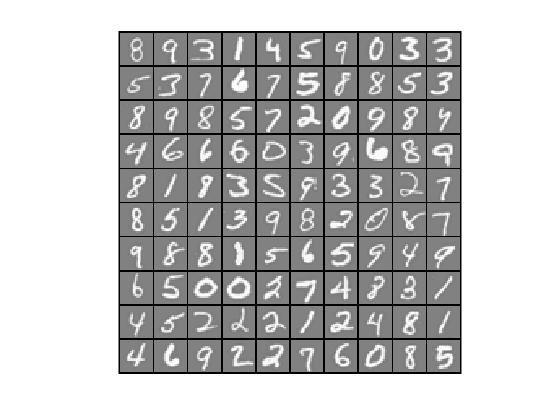

# Neural Network (MATLAB)


## Purposes
#### 1) Implement backpropagation for neural network
#### 2) Recognize hand-written digits


## Features
#### 1) Neural Network
#### 2) Backpropagation (learn weights)
#### 3) Hand-written digit recognition


## Dataset
- ex4data1.mat


## Usage
#### 1) Open MATLAB
#### 2) Open the ex4 folder in MATLAB
#### 3) In the terminal window, execute:  
```
ex4
```


## Development Flow
#### 1) Data Visualization

#### 2) Compute cost function J (Feedforward propagation)
```
% Format y (vector to matrix)
y_mat = zeros(m, num_labels);
for i=1:m
    y_mat(i,y(i)) = 1;
end

% Feedforward propagation

% From layer 1 (input) to layer 2 (hidden)
X = [ones(m,1) X];
a = sigmoid(X * Theta1'); % row = each example | col = a's for the example

% From layer 2 (hidden) to layer 3 (output)
a = [ones(m,1) a];
h = sigmoid(a * Theta2'); % row = each example | col = h's for the example

% Sum up all the errors between my output (h) and expected output
J = 1 / m * sum(sum(-y_mat.*log(h)-(1-y_mat).*log(1-h)));
```
#### 3) Add regularization terms
Do NOT include bias terms (1st columns)!  
```
sum_Theta1 = sum(sum(Theta1(:,2:end).^2));
sum_Theta2 = sum(sum(Theta2(:,2:end).^2));
regularization = lambda / (2*m) * (sum_Theta1 + sum_Theta2);
J = J + regularization;
```
#### 4) Compute sigmoid gradient
```
g = sigmoid(z) .* (1 - sigmoid(z));
```
#### 5) Randomize initial weights (break symmetry)
```
epsilon_init = 0.12;
W = rand(L_out, 1 + L_in) * 2 * epsilon_init - epsilon_init;
```
#### 6) Backpropagation
```
D1 = zeros(hidden_layer_size,1);
D2 = zeros(hidden_layer_size,1);

% For each example
for t = 1:m
    % A) Feedforward propagation

    a1 = [1; X(t,:)'];
    z2 = Theta1 * a1;
    a2 = sigmoid(z2);

    a2 = [1; a2];
    z3 = Theta2 * a2;
    a3 = sigmoid(z3);

    % B) Backpropagation

    % Get errors in layer 3
    d3 = a3 - y_mat(t,:)';
    
    % Get errors in layer 2
    mult = Theta2' * d3;
    d2 = mult(2:end) .* sigmoidGradient(z2);
    
    % C) Accumulate the gradient
    D1 = D1 + d2 * a1';
    D2 = D2 + d3 * a2';
end

Theta1_grad = D1 / m;
Theta2_grad = D2 / m;
```


## Assignment Link
- [Neural Network Learning](https://www.coursera.org/learn/machine-learning/programming/AiHgN/neural-network-learning) 
(Notice: you need to log in to see the programming assignment.)
