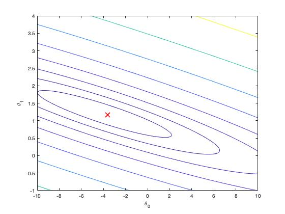

# Machine Learning : Linear Regression (MATLAB)
This is an assignment for the Machine Learning course from Stanford on Coursera.


## Purpose
- Predicts profits for a food truck in different cities


## Feature(s)
#### 1) One Variable
#### 2) Multiple Variables (Cooming soon...)


## Environment
- macOS Catalina (version 10.15.4)
- MATLAB 2018(b)


## Dataset
- ex1data1.txt


## Usage
#### 1) Open MATLAB
#### 2) Open the folder of this directory
#### 3) In the terminal window, execute the function name you like to run. For example:
```
warmUpExercise
```


## Development Flow
#### 1) Data Visualization

#### 2) Gradient Descent
- Compute cost function J
- Update theta to minimize J




## Result


[//]: # (![Result])


## Course Links
1) Machine Learning by Stanford University on [Coursera](https://www.coursera.org/learn/machine-learning)
2) [Linear Regression](https://www.coursera.org/learn/machine-learning/programming/8f3qT/linear-regression) 
(Please notice that you need to log in to see the programming assignment.)
