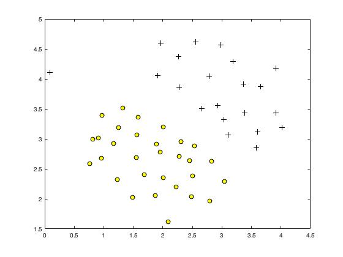
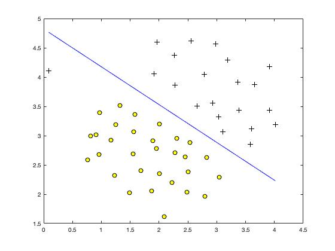
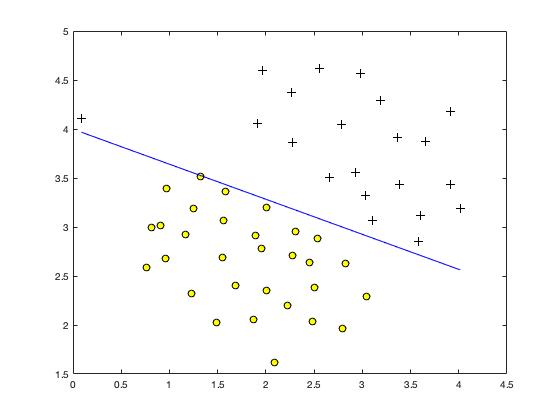
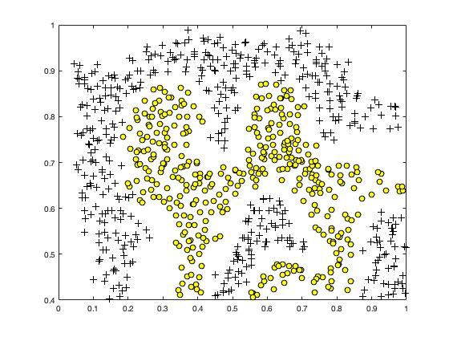
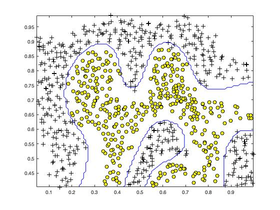
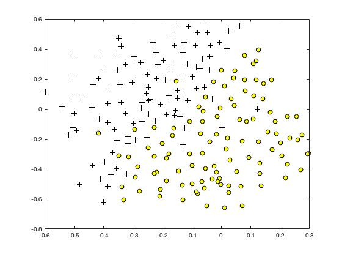
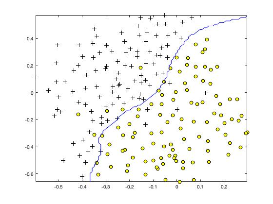

# Support Vector Machines (MATLAB)


## Purposes
#### 1) Work with the example 2D dataset
#### 2) Classify spams


## Features
#### 1) Support Vector Machine
#### 2) Gaussian Kernel
#### 3) Spam Classifier


## Datasets
- ex6data1.mat
- ex6data2.mat
- ex6data3.mat
- emailSample1.txt
- spamTrain.mat
- spamTest.mat


## Additional Data
- vocab.txt (for vocabulary List)


## Dependencies
- svmTrain (SVM software)
- (LIBSVM is preferable in terms of performance)


## Usage
#### 1) Open MATLAB
#### 2) Open the ex6 folder in MATLAB
#### 3) In the terminal window, execute:  
```
ex6
```


## Development Flow on Sample 2D Dataset
#### 1) Data Visualization


#### 2) Various C parameter values
C = 1  
  
C = 100  
  
C = 1000  
  

#### 3) Gaussian Kernel
```
sim = exp( - (x1-x2)'*(x1-x2) / (2*sigma^2) );
```

#### 4) Work with Dataset 2


#### 5) Result on Dataset 2


#### 6) Work with Dataset 3


#### 7) Find the best C and sigma values
```
valueList = [0.01, 0.03, 0.1, 0.3, 1, 3, 10, 30];
resultMat= zeros(8, 8);

for i = 1:length(valueList)
    for j = 1:length(valueList)
        CVal = valueList(i);
        sigmaVal = valueList(j);

        model = svmTrain(X, y, CVal, @(x1, x2) gaussianKernel(x1, x2, sigmaVal));
        predictions = svmPredict(model, Xval);
        predictionError = mean(double(predictions ~= yval));

        resultMat(i, j) = predictionError;
    end
end

minVal = min(resultMat(:));
[i, j] = find(resultMat==minVal);

C = valueList(i);
sigma = valueList(j);
```

#### 8) Result on Dataset 3



## Development Flow on Spam Classifier
#### 1) Pre-process email contents
Normalize features such as upper/lower case, HTML, URLs, email address, etc.
- Before pre-processing  
  
- After pre-processing  
 

#### 2) Replace vocabularies with indices
Look up each word in the email from the vocabulary list, and replace with its index if found.
```
for i = 1:length(vocabList)
        if (strcmp(str, vocabList{i}))
            word_indices = [word_indices ; i];
        end
    end
```
After processing

#### 3) Generate a vector of features
```
x = zeros(n, 1);

for idx = word_indices
    x(idx) = 1;
end
```
#### 4) Result
Test accuracy = 99.0%


## To-Do
- [ ] Build my own dataset from the SpamAssassin Public Corpus (run processEmail and emailFeatures on each email)
- [ ] Build my own vocabulary list
- [ ] Use LIBSVM instead


## Assignment Link
- [Support Vector Machines](https://www.coursera.org/learn/machine-learning/programming/e4hZk/support-vector-machines) 
(Notice: you need to log in to see the programming assignment.)
